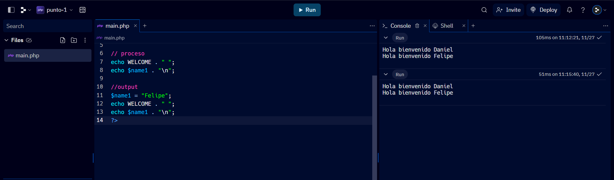
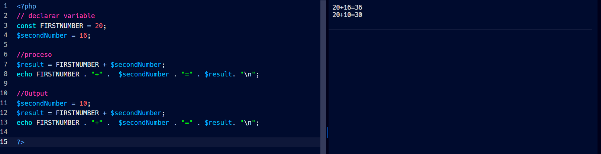
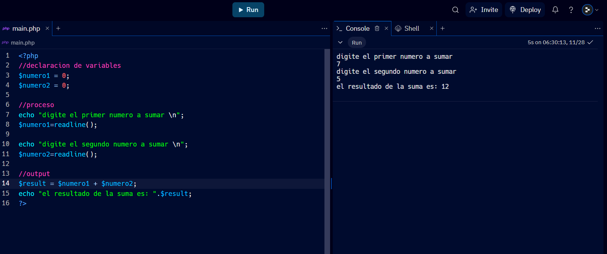
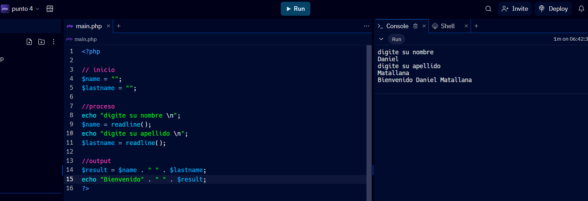
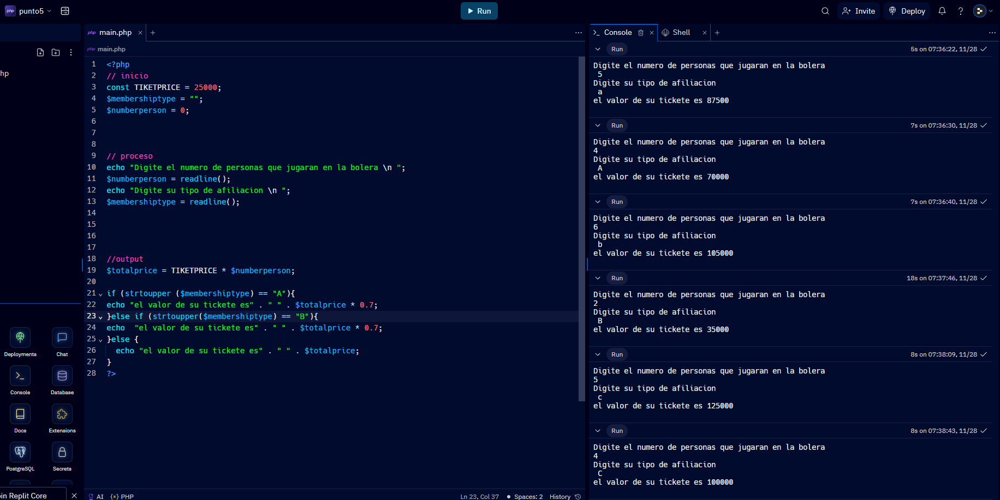
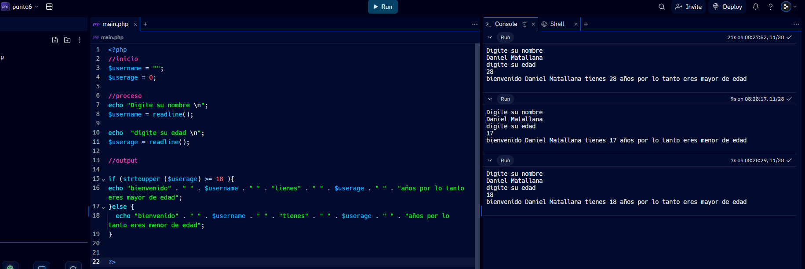

<h1>Taller 10 -- Daniel Felipe Matallana Santacoloma</h1>
<h2>Información</h2>

Curso Full Stack Basico - Grupo 1

Profesor: Cristian Patiño

<h2>Punto 1: Constantes y Variables</h2>

<h2>Punto 2: Suma de Constantes y Variables</h2>

<h2>Punto 3: Suma de dos numeros indicados por el usuario</h2>

<h2>Punto 4: Datos del usuario en consola </h2>

<h2>Punto 5: Entrada de Bolera usando if / else </h2>

<h2>Punto 6: Deteccion de mayoria de edad</h2>

<h2>Punto 7: seleccion de operacion aritmetica</h2>

<h2>Punto 8: Entrada de bolera usando switch</h2>

<h2>Punto 9: Tabla de multiplicar usando while </h2>

<h2>Punto 10: Numeros pares usando while</h2>

<h2>Punto 11: Numeros impares usando for</h2>

<h2>Punto 12: Tabla de multiplicar usando for</h2>

<h2>Punto 13: suma de valores usando foreach</h2>

<h2>Punto 14: revision de contraseña</h2>

<h2>Punto 15: Seleccion de operacion aritmetica usando funciones </h2>